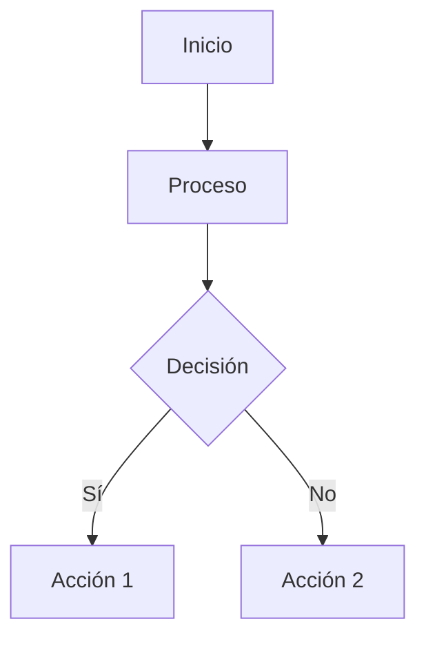

# 📘 Explicación de Código y Diagramas de Flujo - AlquiNumber

## 🎮 Contexto del Proyecto
**AlquiNumber** es un juego educativo de destreza que incluye:
- 🧩 **Puzzles**: Rompecabezas y desafíos lógicos
- ➕ **Ejercicios Matemáticos**: Problemas y cálculos
- 🎴 **Memorama**: Juego de memoria y emparejamiento

---

## 📝 EXPLICACIÓN BREVE DE CADA ARCHIVO

### 1. **MenuInicial.cs** - Controlador del Menú Principal
**¿Qué hace?**  
Gestiona los botones del menú inicial (Jugar, Salir, Atrás) y navega entre escenas.

**Funcionalidad:**  
- Botón "Jugar" → Carga la siguiente escena
- Botón "Salir" → Cierra la aplicación
- Botón "Atrás" → Regresa a la escena anterior

---

### 2. **ProblemaManager.cs** - Gestor de Problemas/Preguntas
**¿Qué hace?**  
Lee problemas desde un archivo CSV y genera preguntas aleatorias con opciones múltiples (puzzles, ejercicios matemáticos, etc.).

**Funcionalidad:**
- Carga CSV con problemas y respuestas
- Selecciona problema aleatorio
- Genera 4 opciones (1 correcta + 3 incorrectas)
- Mezcla las opciones aleatoriamente

---

### 3. **PlayerProgress.cs** - Sistema de Guardado de Progreso
**¿Qué hace?**  
Guarda el progreso del jugador (niveles desbloqueados, experiencia) y persiste entre sesiones.

**Funcionalidad:**
- Patrón Singleton (una sola instancia)
- Guarda niveles desbloqueados
- Guarda puntos de experiencia
- Carga datos al iniciar el juego

---

### 4. **DragDrop.cs** - Sistema de Arrastrar y Soltar
**¿Qué hace?**  
Permite arrastrar elementos de la interfaz con el mouse o touch.

**Funcionalidad:**
- Detecta cuando se presiona un elemento
- Sigue el movimiento del mouse/touch
- Hace el elemento semi-transparente al arrastrar
- Restaura apariencia al soltar

---

### 5. **ItemSlot.cs** - Zona de Soltado
**¿Qué hace?**  
Define áreas donde se pueden soltar elementos arrastrados. Valida si la acción es correcta.

**Funcionalidad:**
- Detecta cuando se suelta un elemento
- Reproduce sonido al soltar
- Muestra efecto visual
- Activa condición lógica si es correcto

---

### 6. **Ingrediente.cs** - Componente de Elemento
**¿Qué hace?**  
Almacena información de elementos que se pueden arrastrar (nombre, tipo de puzzle/matemática).

**Funcionalidad:**
- Almacena nombre del elemento
- Almacena tipo/categoría asociada
- Se usa para validar respuestas

---

### 7. **LevelMenuController.cs** - Controlador de Menú de Niveles
**¿Qué hace?**  
Gestiona la pantalla de selección de niveles, bloqueando los no desbloqueados.

**Funcionalidad:**
- Habilita solo niveles desbloqueados
- Deshabilita niveles bloqueados
- Carga escena al seleccionar nivel

---

### 8. **CambiaEscena.cs** - Navegador de Escenas
**¿Qué hace?**  
Utilidad simple para avanzar a la siguiente escena en orden.

**Funcionalidad:**
- Obtiene índice de escena actual
- Carga escena siguiente

---

### 9. **MetodoNumericoSelector.cs** - Enumeración de Tipos
**¿Qué hace?**  
Define los tipos de juegos/desafíos disponibles (Puzzles, Matemáticas, Memorama, etc.).

**Nota:** Este archivo necesita actualizarse para reflejar los nuevos tipos de juegos de destreza.

---

### 10. **ItemTooltip.cs** - Tooltip de Elementos
**¿Qué hace?**  
Muestra información adicional cuando el jugador pasa el mouse sobre un elemento.

**Funcionalidad:**
- Muestra tooltip al pasar el mouse
- Oculta tooltip al quitar el mouse

---

### 11. **Tooltip.cs** - Base de Tooltips
**¿Qué hace?**  
Componente base para mostrar tooltips en diferentes posiciones.

**Funcionalidad:**
- Muestra mensaje en posición específica
- Sigue la posición del mouse
- Oculta tooltip

---

### 12. **UIButtonSound.cs** - Sonidos de Botones
**¿Qué hace?**  
Agrega sonidos a los botones de la interfaz (hover y click).

**Funcionalidad:**
- Reproduce sonido al pasar el mouse
- Reproduce sonido al hacer click

---

### 13. **levitacion.cs** (FloatingItem) - Efecto de Flotación
**¿Qué hace?**  
Crea efecto visual de flotación/levitación en elementos de la UI.

**Funcionalidad:**
- Oscila elementos verticalmente
- Crea aura visual alrededor
- Detiene animación al arrastrar

---

## 🔄 DIAGRAMAS DE FLUJO

---

## 📊 DIAGRAMA 1: Flujo General del Juego

```
┌─────────────────┐
│   INICIO        │
│   (Unity)       │
└────────┬────────┘
         │
         ▼
┌─────────────────┐
│ MenuInicial     │
│  - Botón Jugar  │
│  - Botón Salir  │
└────────┬────────┘
         │
    [Click Jugar]
         │
         ▼
┌─────────────────┐
│LevelMenuController│
│ Selecciona Nivel│
└────────┬────────┘
         │
    [Selecciona]
         │
         ▼
┌─────────────────┐
│  Escena de Juego│
│  ProblemaManager│
└────────┬────────┘
         │
         ▼
┌─────────────────┐
│ Carga CSV       │
│ Problemas       │
└────────┬────────┘
         │
         ▼
┌─────────────────┐
│ Selecciona      │
│ Problema Random │
└────────┬────────┘
         │
         ▼
┌─────────────────┐
│ Genera Opciones │
│ (1 correcta +   │
│  3 incorrectas) │
└────────┬────────┘
         │
         ▼
┌─────────────────┐
│ DragDrop        │
│ Jugador arrastra│
└────────┬────────┘
         │
         ▼
┌─────────────────┐
│ ItemSlot        │
│ Valida respuesta│
└────────┬────────┘
         │
    ¿Correcto?
    ┌────┴────┐
    │         │
   SÍ         NO
    │         │
    ▼         ▼
┌─────────┐ ┌─────────┐
│Player   │ │Muestra │
│Progress │ │Error    │
│Guarda XP│ │        │
└─────────┘ └─────────┘
    │
    ▼
┌─────────────────┐
│ ¿Siguiente      │
│  Nivel?         │
└────────┬────────┘
         │
      [Sí/No]
```

---

## 📊 DIAGRAMA 2: Flujo de ProblemaManager.cs

```
┌─────────────────────┐
│  ProblemaManager    │
│     Start()         │
└──────────┬──────────┘
           │
           ▼
┌─────────────────────┐
│ MostrarProblema()   │
└──────────┬──────────┘
           │
           ▼
    ¿CSV asignado?
    ┌─────┴─────┐
    │           │
   NO          SÍ
    │           │
    ▼           ▼
┌─────────┐ ┌──────────────┐
│ERROR    │ │Lee archivo   │
│return   │ │CSV            │
└─────────┘ └──────┬───────┘
                   │
                   ▼
┌──────────────────────┐
│Divide en líneas      │
│Primera línea =       │
│encabezados           │
└──────┬───────────────┘
       │
       ▼
┌──────────────────────┐
│Filtra filas válidas  │
│(mismo número de      │
│columnas)             │
└──────┬───────────────┘
       │
       ▼
┌──────────────────────┐
│Selecciona fila       │
│aleatoria             │
└──────┬───────────────┘
       │
       ▼
┌──────────────────────┐
│Separa métodos:       │
│- Correctos (1)       │
│- Incorrectos (0)     │
└──────┬───────────────┘
       │
       ▼
┌──────────────────────┐
│Selecciona:           │
│- 1 correcto          │
│- 3 incorrectos       │
└──────┬───────────────┘
       │
       ▼
┌──────────────────────┐
│Mezcla opciones       │
│aleatoriamente        │
└──────┬───────────────┘
       │
       ▼
┌──────────────────────┐
│Muestra problema y    │
│opciones en Debug     │
└──────────────────────┘
```

---

## 📊 DIAGRAMA 3: Flujo de PlayerProgress.cs

```
┌─────────────────────┐
│  PlayerProgress     │
│     Awake()         │
└──────────┬──────────┘
           │
           ▼
    ¿Instance existe?
    ┌─────┴─────┐
    │           │
   SÍ          NO
    │           │
    ▼           ▼
┌─────────┐ ┌──────────────┐
│Destroy  │ │Instance = this│
│GameObject│ │DontDestroyOnLoad│
└─────────┘ └──────┬───────┘
                   │
                   ▼
┌──────────────────────┐
│  CargarProgreso()    │
│  - Lee PlayerPrefs   │
│  - nivelMaxDesbloqueado│
│  - experiencia       │
└──────────────────────┘
           │
           │
     [Durante Juego]
           │
           ▼
┌──────────────────────┐
│ GanarExperiencia()   │
│ experiencia += XP   │
└──────┬───────────────┘
       │
       ▼
┌──────────────────────┐
│ DesbloquearNivel()   │
│ nivelMaxDesbloqueado │
│ = nuevo nivel        │
└──────┬───────────────┘
       │
       ▼
┌──────────────────────┐
│ GuardarProgreso()    │
│ PlayerPrefs.SetInt() │
└──────────────────────┘
```

---

## 📊 DIAGRAMA 4: Flujo de DragDrop.cs

```
┌─────────────────────┐
│ Usuario presiona    │
│ sobre elemento      │
└──────────┬──────────┘
           │
           ▼
┌─────────────────────┐
│ OnPointerDown()     │
│ Detecta click       │
└──────────┬──────────┘
           │
           ▼
┌─────────────────────┐
│ OnBeginDrag()       │
│ - alpha = 0.6       │
│ - blocksRaycasts=   │
│   false             │
└──────────┬──────────┘
           │
           │
      [Arrastrando]
           │
           ▼
┌─────────────────────┐
│ OnDrag()            │
│ (se ejecuta cada    │
│  frame mientras     │
│  arrastra)          │
│ - Actualiza posición│
└──────────┬──────────┘
           │
           │
    [Usuario suelta]
           │
           ▼
┌─────────────────────┐
│ OnEndDrag()         │
│ - alpha = 1.0       │
│ - blocksRaycasts=   │
│   true              │
└──────────┬──────────┘
           │
           ▼
┌─────────────────────┐
│ ItemSlot.OnDrop()   │
│ (si se soltó sobre  │
│  un slot válido)    │
└─────────────────────┘
```

---

## 📊 DIAGRAMA 5: Flujo de ItemSlot.cs (Validación)

```
┌─────────────────────┐
│ Elemento soltado    │
│ sobre ItemSlot      │
└──────────┬──────────┘
           │
           ▼
┌─────────────────────┐
│ OnDrop()            │
│ Detecta soltado     │
└──────────┬──────────┘
           │
           ▼
┌─────────────────────┐
│ Obtiene elemento    │
│ soltado             │
└──────────┬──────────┘
           │
           ▼
┌─────────────────────┐
│ ¿destroySound       │
│ existe?             │
└──────┬──────────────┘
       │
      SÍ
       │
       ▼
┌─────────────────────┐
│ Reproduce sonido    │
│ AudioSource.Play    │
└──────┬──────────────┘
       │
       ▼
┌─────────────────────┐
│ ¿destroyEffect      │
│ existe?             │
└──────┬──────────────┘
       │
      SÍ
       │
       ▼
┌─────────────────────┐
│ Instancia efecto    │
│ visual              │
└──────┬──────────────┘
       │
       ▼
┌─────────────────────┐
│ Desactiva elemento  │
│ soltado             │
└──────┬──────────────┘
       │
       ▼
┌─────────────────────┐
│ conditionMet = true │
│ (Indica que se      │
│  completó acción)   │
└─────────────────────┘
```

---

## 📊 DIAGRAMA 6: Flujo de LevelMenuController.cs

```
┌─────────────────────┐
│ LevelMenuController │
│     Start()         │
└──────────┬──────────┘
           │
           ▼
┌─────────────────────┐
│ Itera sobre todos   │
│ los botones         │
└──────────┬──────────┘
           │
           ▼
┌─────────────────────┐
│ Para cada botón:    │
│ levelIndex = i + 1  │
└──────────┬──────────┘
           │
           ▼
    ¿levelIndex <=
    maxLevelUnlocked?
    ┌─────┴─────┐
    │           │
   SÍ          NO
    │           │
    ▼           ▼
┌─────────┐ ┌──────────────┐
│Habilita │ │Deshabilita   │
│botón    │ │botón         │
│interactable│ │(gris)      │
│= true   │ │              │
│         │ │              │
│Agrega   │ │              │
│listener │ │              │
│LoadLevel│ │              │
└─────────┘ └──────────────┘
    │
    │
    │ [Usuario click]
    │
    ▼
┌─────────────────────┐
│ LoadLevel()         │
│ Carga escena:       │
│ "Level" + levelIndex│
└─────────────────────┘
```

---

## 📊 DIAGRAMA 7: Flujo Completo de Interacción con Puzzle/Matemáticas

```
                    ┌─────────────────┐
                    │  Inicio Escena  │
                    │   de Juego      │
                    └────────┬────────┘
                             │
                             ▼
                    ┌─────────────────┐
                    │ ProblemaManager │
                    │ Carga CSV       │
                    └────────┬────────┘
                             │
                             ▼
                    ┌─────────────────┐
                    │ Selecciona      │
                    │ problema random │
                    │ (Puzzle/Math/   │
                    │  Memorama)      │
                    └────────┬────────┘
                             │
                             ▼
                    ┌─────────────────┐
                    │ Muestra         │
                    │ problema en UI  │
                    │ con 4 opciones  │
                    └────────┬────────┘
                             │
                    ┌────────┴────────┐
                    │                 │
            [Opción 1]        [Opción 2]
                    │                 │
                    ▼                 ▼
            ┌──────────┐      ┌──────────┐
            │ DragDrop │      │ DragDrop │
            │ Arrastra │      │ Arrastra │
            └────┬─────┘      └────┬─────┘
                 │                 │
                 └────────┬────────┘
                          │
                          ▼
                 ┌─────────────────┐
                 │ ItemSlot        │
                 │ OnDrop()        │
                 └────────┬────────┘
                          │
                    ¿Correcto?
                 ┌────────┴────────┐
                 │                 │
                SÍ                NO
                 │                 │
                 ▼                 ▼
        ┌──────────────┐   ┌──────────────┐
        │PlayerProgress│   │Muestra       │
        │GanarXP()     │   │Error/Intento │
        │              │   │incorrecto    │
        │Desbloquear   │   └──────────────┘
        │Siguiente()   │
        └──────┬───────┘
               │
               ▼
        ┌──────────────┐
        │ ¿Completó     │
        │ todos los     │
        │ niveles?      │
        └──────┬───────┘
               │
            [Fin]
```

---

## 📊 DIAGRAMA 8: Flujo de Memorama (Propuesto)

```
┌─────────────────────┐
│  Inicia Nivel       │
│  Memorama           │
└──────────┬──────────┘
           │
           ▼
┌─────────────────────┐
│ Genera pares de     │
│ cartas/piezas       │
└──────────┬──────────┘
           │
           ▼
┌─────────────────────┐
│ Mezcla posición     │
│ de cartas           │
└──────────┬──────────┘
           │
           ▼
┌─────────────────────┐
│ Jugador click       │
│ carta 1             │
└──────────┬──────────┘
           │
           ▼
┌─────────────────────┐
│ Muestra carta 1     │
└──────────┬──────────┘
           │
           ▼
┌─────────────────────┐
│ Jugador click       │
│ carta 2             │
└──────────┬──────────┘
           │
           ▼
┌─────────────────────┐
│ Muestra carta 2     │
└──────────┬──────────┘
           │
           ▼
    ¿Son iguales?
    ┌─────┴─────┐
    │           │
   SÍ          NO
    │           │
    ▼           ▼
┌─────────┐ ┌──────────────┐
│Mantiene │ │Oculta ambas  │
│cartas   │ │cartas        │
│visibles │ │              │
│         │ │              │
│XP += 10 │ │Intento +1    │
└─────────┘ └──────────────┘
    │
    │
    ▼
┌─────────────────────┐
│ ¿Todos los pares    │
│ encontrados?        │
└──────┬──────────────┘
       │
      SÍ
       │
       ▼
┌─────────────────────┐
│ Nivel Completado    │
│ Desbloquear siguiente│
└─────────────────────┘
```

---

## 🎨 INSTRUCCIONES PARA CREAR LOS DIAGRAMAS GRÁFICOS

### Opción 1: Usar Draw.io / Diagrams.net
1. Abre [draw.io](https://app.diagrams.net/)
2. Usa las formas:
   - **Óvalos** → Inicio/Fin
   - **Rectángulos** → Procesos
   - **Rombo** → Decisiones (Sí/No)
   - **Flechas** → Flujo
3. Copia los diagramas de texto de arriba como referencia

### Opción 2: Usar Mermaid (Markdown)
Los diagramas pueden convertirse a Mermaid usando:


### Opción 3: Usar PowerPoint/Google Slides
1. Usa SmartArt o formas básicas
2. Organiza según los diagramas de texto
3. Agrega colores para mejor visualización

---

## 📋 CHECKLIST PARA DIAGRAMAS GRÁFICOS

- [ ] Diagrama 1: Flujo General del Juego
- [ ] Diagrama 2: ProblemaManager.cs
- [ ] Diagrama 3: PlayerProgress.cs
- [ ] Diagrama 4: DragDrop.cs
- [ ] Diagrama 5: ItemSlot.cs
- [ ] Diagrama 6: LevelMenuController.cs
- [ ] Diagrama 7: Flujo de Interacción
- [ ] Diagrama 8: Flujo de Memorama (si aplica)

---

## 📝 NOTAS IMPORTANTES

1. **Cambio de Temática**: El juego ahora es de destreza (puzzles, matemáticas, memorama) en lugar de métodos numéricos.

2. **Archivo a Actualizar**: `MetodoNumericoSelector.cs` debe cambiarse a algo como `TipoJuegoSelector.cs` con valores: Puzzle, EjercicioMatematico, Memorama, etc.

3. **CSV**: El formato del CSV debe adaptarse para los nuevos tipos de juegos.

---

**Última actualización:** _______________

